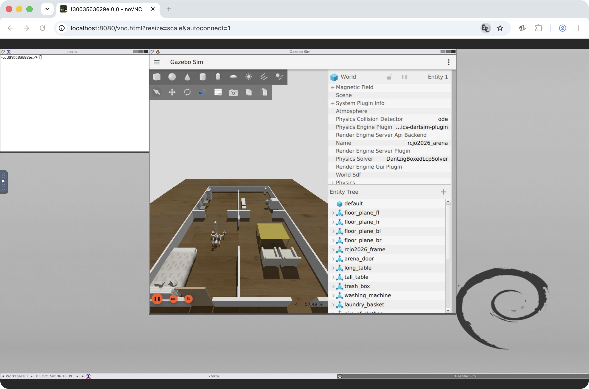

# SOBITS Japan Open 2026

標準worldは `sobits_gazebo_worlds`、床・机のモデルは `tmc_wrs_gz_worlds` を使う。
取得・ビルド・通常起動は [開発コンテナの起動フロー](docker.md#起動フロー)を参照。

## 起動設定

| 引数 | 設定 |
| --- | --- |
| `world:=rcjo2026` | 既定。初期位置 `(-2.0, 1.5, 0.10)` m、yaw `0.0` rad |
| `world:=empty.sdf` | 空world。初期位置 `(0.0, 0.0, 0.05)` m |
| `world_path:=/absolute/path/world.sdf` | 展開済みSDFで上書き。既定の初期位置は空worldと同じ |
| `spawn_x` / `spawn_y` / `spawn_z` / `spawn_yaw` | 初期位置の上書き |
| `headless:=true` | GUIなし |
| `use_sim_time:=true` | 既定。ROS nodeでシミュレーション時刻を使う |
| `use_perception:=true` | 頭部カメラのbridge・点群・RVizを起動。`rviz:=false` でRVizと操作パネルを除く。[aha_perception](../overlay_ws/src/aha_perception/README.md#シミュレーション)を参照 |
| `use_nav` / `use_manip` | 既定は `false`。現在の各launchはスタブ |

Xacroは起動時にSDFへ展開し、[preset](../overlay_ws/src/aha_gazebo/config/rcjo2026.json)の
チェックサム・world名・モデル参照を検証する。worldの形状は変更しない。
[出典・ライセンス](../dependencies/THIRD_PARTY.md)を参照。

