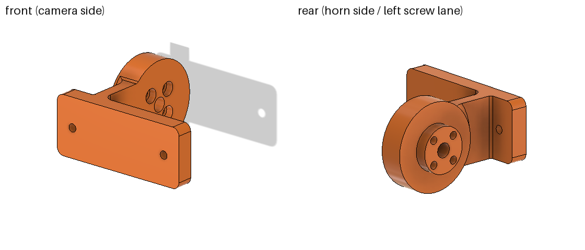
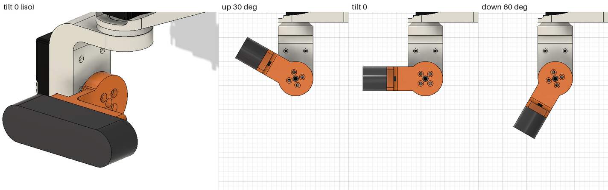

# head_cam_mount_d435i — 頭部チルトサーボ用 RealSense D435i ブラケット

> **ライセンス**: このディレクトリのファイルは上流 `Astra_Hardwares` の `HeadCamMount` からの派生物で、
> 上流と同じ **GPL-3.0 + 非商用** の条件が適用される。`aha_perception` パッケージの Apache-2.0 とは異なる
> （[出典一覧](../../../../../dependencies/THIRD_PARTY.md)）。

AhaRobot の頭部チルトサーボ（ST3215、`WristPitch` ブラケット内）に Intel RealSense D435i を
取り付けるための 3D プリント部品。形はホーン円盤・縦のウェブ・カメラプレートからなる単純な L 字。

## 出典・ライセンス

- サーボホーン側の円盤は上流の `upstream/Astra_Hardwares/Astra/STL/HeadCamMount.STL`
  （Astra.STEP 内 `Link_Head_Tilt^Astra:1/HeadCamMount:1`）のホーン接続部を、Fusion のスケッチ・押し出し・
  穴フィーチャで作り直したもの。形状と組立位置は上流と同一（上流ソリッドとのブーリアン差は両方向とも 0 mm³）。
  上流の円盤の前側にあった D 字の角（旧カメラプレートにつながる部分）はなくし、単純な円にした。
- 設計は Autodesk Fusion（ドキュメント `AhaRobot_head_ref`）で行い、ここに書き出したファイルが成果物。

## ファイル

| ファイル | 内容 |
|---|---|
| `head_cam_mount_d435i.stl` | 印刷用（mm、印刷姿勢: カメラ取付面が Z=0 のベッド面、高さ 58 mm） |
| `head_cam_mount_d435i.step` | 取付座標系（原点 = チルト軸とパン軸の交点、+X ロボット左 / +Y 上 / +Z 前、mm） |
| `head_cam_mount_d435i.f3d` | Fusion アーカイブ（部品コンポーネントのみ。ユーザーパラメータ・スケッチ・履歴付き） |
| `preview_iso.png` | 部品単体（左: カメラ側、右: ホーン側と左ネジの通り道） |
| `root_closeup.png` | ウェブ根元の拡大（左: +X 側、右: −X 側の R4） |
| `assembly_tilt.png` | 頭部アセンブリ内（D435i ダミー付き）: チルト 0°（等角）と上 30° / 0° / 下 60°（側面） |
| `urdf_head_check.png` | URDF 上の確認: `link_head_tilt` のメッシュと `camera_link` の箱（上 30° / 0° / 下 60°） |
| [`aha_description/meshes/head_cam_mount_d435i.stl`](../../../aha_description/meshes/head_cam_mount_d435i.stl) | URDF 用メッシュ（`link_head_tilt` 座標、mm、URDF 側で scale 0.001） |

## 形状と主要寸法

座標は取付座標系（チルト軸上、パン軸 x=0 が原点）。

- **ホーン円盤**（上流と同一）
  - 円盤 Ø36 × 10（x = −23 … −13）+ ホーン側ボス Ø19 × 4.8（x = −27.8 … −23）、合計厚さ 14.8
  - ボスは AXK2035 スラストベアリング（内径 20）を通ってサーボホーン面に当たる（凹みではなく凸）
  - Ø3.2 貫通 × 4（PCD 14 = 9.9 mm 角の 45° 配置）、+X 面側に Ø6 × 深さ 3 の座ぐり
  - 中心 Ø6 貫通
  - ネジ穴の長さ（座ぐり底〜ホーン当たり面）は **11.8 mm**
- **ウェブ**（縦板 1 枚）: 厚さ 5（x = −18 … −13）、高さ 25（カメラと同じ、y = ±12.5）、
  円盤前縁（z = 12）からプレート背面（z = 33）まで
  - +X 面は円盤の +X 面（x = −13）と同一面（位置は `disc_offset` から決まる）
  - 円盤とはリム付近（z ≥ 12）でつながる。円盤 +X 面の座ぐり（z ≤ 7.95）と中心穴はふさがない
  - 左カメラネジの通り道（x = −22.5）に溝はない
  - フィレット: ウェブ +X 側〜プレート R4、ウェブ −X 側〜プレート R1、ウェブ上下面〜円盤リム R2、
    **ウェブ −X 面〜円盤リム R4**（リムの段差をなめらかにするもの。x = −22 … −18、z = 12.4 … 22 の範囲）
- **カメラプレート**: 60 × 25 × 厚さ 7.0、角 R3、背面は z = 33、前面（カメラ当たり面）は z = 40
  - D435i 背面の M3 ネジ穴に合わせて Ø3.4 × 2、ピッチ 45（カメラ中心に対して ±22.5、高さ中央）
  - 座ぐりなし。M3×10 の頭（高さ 2.5 mm）はプレート背面に残り、カメラへのかかりは 10 − 7 = 3.0 mm
  - カメラ両端面は覆わない（プレート端 x = ±30、カメラ端 x = ±45）
- **カメラ位置**: 左右はパン軸中心（x = 0）、上下はチルト軸の高さ、向きは +Z
  - カメラ背面はチルト軸から **40 mm** 前（`forward_offset`）、本体中心は 52.525 mm 前、前面は 65.05 mm 前
- **外形**: 60 × 36 × 58 mm（印刷姿勢では高さ 58 mm）
- **体積・質量**: 22.98 cm³。中実 PLA（1.24 g/cm³）で **28.5 g**（Fusion の物性値）。
  印刷品の質量はインフィルで変わる（未測定）
- **重心**: チルト軸から (x, y, z) = (−10.1, 0, 18.8) mm。カメラ 72 g（本体中心 52.5 mm 前）を合わせた
  チルト 0° での自重モーメントは約 0.042 N·m（0.43 kgf·cm）

### Fusion の履歴（コンポーネント `head_cam_mount_d435i`）

| # | フィーチャ | 内容 |
|---|---|---|
| 1 | `disc_face_plane` | 円盤 +X 面の作業平面（YZ 平面から `-disc_offset`） |
| 2 | `disc_sketch` | Ø`disc_dia` と Ø`boss_dia` の同心円 |
| 3 | `disc` | 円盤を −X に `disc_thickness` 押し出し |
| 4 | `boss` | 円盤 −X 面から `boss_height` 押し出し（結合） |
| 5 | `horn_hole_sketch` | PCD `horn_pcd` の 4 点（対角線の端点）と中心点 |
| 6 | `horn_holes` | 穴フィーチャ: Ø`horn_hole_dia` 貫通、Ø`horn_cbore_dia` × `horn_cbore_depth` 座ぐり |
| 7 | `center_hole` | 穴フィーチャ: Ø`center_hole_dia` 貫通 |
| 8 | `plate_back_plane` | プレート背面の作業平面（XY 平面から `forward_offset - plate_thickness`） |
| 9 | `plate_sketch` / `camera_plate` | プレート外形と Ø`hole_dia` × 2 を `plate_thickness` 押し出し（別ボディ） |
| 10 | `plate_corner_fillet` | プレート角 R`plate_corner_r` |
| 11 | `web_sketch` / `web` | ウェブ断面（XZ 平面、+X 面は `disc_offset`、厚さ `web_thickness`）を `plate_height` で対称押し出し |
| 12 | `join_disc_plate_web` | 円盤 + プレート + ウェブを結合 |
| 13 | `junction_fillets` | ウェブ +X 側〜プレート R`fillet_r`、−X 側〜プレート R`fillet_lane_r`、ウェブ上下面〜円盤リム R`fillet_r / 2` |
| 14 | `rim_web_fillet_lane_side` | ウェブ −X 面〜円盤リム R`rim_fillet_r` |

スケッチはすべて完全拘束。D435i ダミー（`D435i_dummy`、確認用）は別コンポーネントで、M3 頭の高さは `screw_head_h`。

### Fusion ユーザーパラメータ

| 名前 | 値 | 内容 |
|---|---|---|
| `forward_offset` | 40 mm | チルト軸からカメラ背面までの距離 |
| `plate_thickness` | 7 mm | プレート厚（M3×10 でかかり 3 mm） |
| `plate_width` | 60 mm | プレート幅 (X) |
| `plate_height` | 25 mm | プレート高さ (Y) = ウェブ高さ |
| `plate_corner_r` | 3 mm | プレート角 R |
| `hole_dia` | 3.4 mm | カメラネジ穴（M3 + 0.4） |
| `hole_spacing` | 45 mm | D435i 背面ネジピッチ |
| `disc_dia` | 36 mm | ホーン円盤の直径 |
| `disc_thickness` | 10 mm | ホーン円盤の厚さ (X) |
| `disc_offset` | 13 mm | パン軸から円盤 +X 面までの距離（円盤は x = −(disc_offset + disc_thickness) … −disc_offset）。ウェブ +X 面もこの位置 |
| `boss_dia` | 19 mm | ホーン側ボスの直径（AXK2035 の内径 20 に入る） |
| `boss_height` | 4.8 mm | ホーン側ボスの高さ |
| `horn_hole_dia` | 3.2 mm | ホーンネジの穴 |
| `horn_pcd` | 14 mm | ホーンネジの PCD |
| `horn_cbore_dia` | 6 mm | ホーンネジの座ぐり径（+X 面） |
| `horn_cbore_depth` | 3 mm | ホーンネジの座ぐり深さ（ネジ頭 2.5 mm より深い） |
| `center_hole_dia` | 6 mm | 中心穴（ホーン中心ネジ用） |
| `web_thickness` | 5 mm | ウェブ厚 (X)。ウェブは x = −(disc_offset + web_thickness) … −disc_offset |
| `web_back_z` | 12 mm | ウェブ後端 Z（円盤とはリム付近でつなぎ、ホーンネジへの +X アクセスを確保） |
| `fillet_r` | 4 mm | ウェブ +X 側〜プレートの R（ウェブ上下面〜円盤リムはこの 1/2） |
| `fillet_lane_r` | 1 mm | ウェブ −X 側〜プレートの R（左ネジの通り道側） |
| `rim_fillet_r` | 4 mm | ウェブ −X 面〜円盤リムの R |
| `screw_head_h` | 2.5 mm | M3 キャップボルトの頭の高さ（ダミー用、実測値） |
| `cam_depth` | 25.05 mm | D435i ダミーの奥行き |
| `cam_width` / `cam_height` | 90 / 25 mm | D435i の寸法の記録（ダミーの外形スケッチは固定寸法で、この 2 つは参照されていない） |

## forward_offset = 40 mm の根拠

左ネジの後ろにあるのはブラケット自身の円盤だけなので、次の条件で決めた。

1. **左カメラネジの差し込み**: ネジ部 10 mm + 頭 2.5 mm = **12.5 mm** の空きがあればよい。締めるときは
   −X 側が開いているので、頭を横からペンチでつまんで回すか、ボールポイントの六角ドライバーを斜めに当てる
   （まっすぐ後ろから工具を入れる長さは要らない）。
   40 mm のとき空きは 14.1 mm（下記）。空きはおおよそ `forward_offset` − 25.9 mm なので、38.4 mm より短くすると 12.5 mm を下回る。
2. **干渉なし（隙間 3 mm 以上）**: 上 30° 〜 下 60° を 5° 刻みで確認（下の表、最小 4.33 mm）。
3. **ホーンネジへのアクセス**: 円盤 +X 面の座ぐり 4 個と中心穴に +X 方向から六角レンチが届くこと（距離によらず満たす）。

## 検証結果（Fusion、`measureMinimumDistance`、最終形状）

### チルト（上 30° 〜 下 60°、5° 刻み）

静止側: チルトサーボ `ST3215.step (25)` の全サブボディ 8 個（fullPathName で一致させて確認）、`WristPitch:3`、
パン側の `AXK2035:8` と M3×16 × 4、`HeadYaw`、パンサーボ `ST3215.step:1`、3060 アルミフレーム、
昇降レール GT45-1200 L/R（計 36 ボディ）。上流の `HeadCamMount` / `HeadCamera` は非表示にし、
チルト側のベアリング `AXK2035:1` は除外。ブラケットはホーン円盤（上流と同一）を除いた部分で計測。
M3 頭は高さ 2.5 mm のダミー。

| チルト | ブラケット（円盤の外） | カメラ + M3 頭 |
|---|---|---|
| 上 30° | **4.33 mm**（WristPitch） | 7.85 mm（左 M3 頭 〜 WristPitch） |
| 上 25° | 5.28 | 9.17 |
| 上 20° | 5.28 | 10.31 |
| 上 15° | 5.28 | 11.25 |
| 上 10° | 5.28 | 11.97 |
| 上 5° | 5.28 | 12.45 |
| 0° 〜 下 60°（5° 刻み） | 5.28 | 12.62 |

- 全体の最小は **4.33 mm（上 30°、ブラケットと WristPitch）**。条件の 3 mm は満たす。
  上 25° 以下ではブラケットは 5.28 mm（−X 側の R4 と WristPitch 側板の間）。
- カメラと M3 頭の最小は **7.85 mm（上 30°、左 M3 頭と WristPitch）**。
- ホーン接続部（円盤・ボス）は上流と同じ形状・同じ位置なので、上流と同じ隙間がそのまま残る:
  ボス 〜 WristPitch の Ø22 穴 1.5 mm（半径方向）、サーボケース（GE_27）1.58 mm、SG-ZIJI_15 2.96 mm。
  上流の HeadCamMount でも同じ値。上流の HeadCamMount と AXK2035:1 はチルト 0° で接触のみ（ベアリング座）。

### パン ±90°（チルト 上 30° / 0° / 下 60°）

ブラケットとカメラ本体を、昇降レール GT45-1200 L/R・3060 フレーム・HeadYaw と比較（パン +: ロボット左）。
どのチルトでも、ブラケットは 20 mm 以上、カメラ本体はレールまで **23.0 mm**（左右とも）。

### カメラネジ・ホーンネジ

- **左カメラネジの通り道**（ブラケット単体、プレート背面から後方への空き）: 工具 Ø6 で **14.1 mm**、
  ネジ頭 Ø5.5 で **14.3 mm**。最初に当たるのは −X 側の R4 フィレット。
  ネジの差し込みに必要な 12.5 mm（ネジ部 10 + 頭 2.5）は足りる。締めるときは横からペンチで回すか、ボールポイントドライバーを斜めに当てる。
- **右カメラネジ**: 後方 40 mm 以上なにもない。
- **ホーンネジ**: 座ぐり 4 個と中心穴から +X に x = +50 mm まで、Ø6 と Ø8 の工具円柱がブラケットに当たらない。

### 書き出しファイルの確認

- 印刷用 STL（trimesh）: 水密・向きの整合 OK、1 ボディ、体積 22977.0 mm³（Fusion 22980.6 mm³、差 −0.02 %）、
  外形 60.0 × 36.0 × 58.0 mm、Z = 0 の面積 1474.1 mm²（= カメラプレート前面: 60 × 25、角 R3、Ø3.4 × 2）
- URDF 用 STL: 水密 OK、1 ボディ、体積差 0.000 %、x の最大 40.000 mm（プレート前面 = カメラ背面）、140 KiB
- STEP: 新しい一時ドキュメントに読み込み、ソリッド 1 個・体積 22980.648 mm³（Fusion と一致）を確認して保存せずに閉じた
- f3d: zip として正常（32 メンバー）。上記のパラメータ名・フィーチャ名を含む（`screw_head_h` はダミー側のパラメータなので含まない）

## ロボットモデル（URDF）への反映

- `link_head_tilt` の visual / collision メッシュを、このブラケット（`aha_description/meshes/head_cam_mount_d435i.stl`）に
  ビルド時に差し替えている（`aha_description/scripts/patch_limits.py` が上流 URDF のコピーを書き換える。`upstream/` は触らない）。
- メッシュは Fusion から `link_head_tilt` 座標で直接書き出している（mm、URDF 側で `scale="0.001 0.001 0.001"`）。
  取付座標系（+X 左 / +Y 上 / +Z 前）から `link_head_tilt`（+x 前 / +y 下 / +z 左、原点同じ）への変換は
  x = Z、y = −Y、z = X（並進なし）。
- 慣性はブラケット（28.5 g）+ D435i（72 g の箱、本体中心 52.525 mm 前）の合計 100.5 g、
  重心 (0.0430, 0, −0.0029) m（`link_head_tilt` 座標）に置き換えた。上流の値（32.3 g、重心は後方 −7.6 mm）は
  旧ヘッドのもので、D435i の質量も入っていなかったため。
- 上流の `link_head_tilt.STL` は STEP の HeadCamMount とは別の旧形状（円盤の D 字の角が −x 側、カメラが
  チルト軸より後方、厚さ 14.8 mm の円盤＋カメラのみ）で、チルト軸まわりに 180° 回った向きになっている。
  円盤の軸（原点を通る z 軸）とボス・円盤・ベアリングの z 方向の位置（−27.8 / −23 / −13 mm）は一致するので、
  横方向（z）と軸位置のずれはない。前後・上下の向きは、カメラが前を向いている sensors.xacro（`camera_link` は
  +x 52.525 mm、シミュレーションで正面の壁を正しく見ることを確認済み）に合わせた。
- D435i 本体は従来どおり `camera_link` の箱（25.05 × 90 × 25 mm、`link_head_tilt` から 0.052525 m 前、
  sensors.xacro の `camera_back_offset` = 0.040）で表示。RGB 光学中心（`camera_color_optical_frame`）は
  `link_head_tilt` から (0.06075, 0, 0.0325) m。
  ブラケットのプレート前面（x = 0.040 m）と箱の背面（0.052525 − 0.012525 = 0.040 m）が一致することを、
  robot_state_publisher の TF（上 30° / 0° / 下 60°）で確認した（`urdf_head_check.png`）。

## ケーブル（USB-C）

D435i の USB-C はロボット左側（+X）の端面にある。パン左でこの端面が昇降レールに近づく。

- **ストレートの USB-C プラグ + ケーブル（突き出し約 30 mm）はパン左でレールに当たる。**
  Fusion 計算（端面の外 30 mm × 25 × 25.05 の箱、実物は未確認）: パン左 90° は全チルトで接触。
  75° では 上 30° で 2.9 mm、0° で 5.9 mm、下 60° で接触。70° では 下 60° で 0.7 mm、65° で 3.9 mm。
- **対策: L 字（直角）USB-C ケーブルを使い、後方または下方へ取り回す**。
  ストレートのまま使うならパン左を約 60〜65° に制限する（下 60° を含めて余裕を見るなら 60°）。
- L 字プラグの確認（Fusion）: プラグ本体を端面から横 12 × 高さ 8 × 前後 12 mm、ケーブルを後方
  （または下方）へ 30 mm 伸びる 6 × 5 mm 断面で近似。パン左 90° でレールとの隙間は
  **11.0 mm**（上 30° / 下 60°、0° では 11.0 mm）。後方・下方どちらの取り回しでも最小は同じ（プラグ本体の位置で決まる）。

## ネジ

| 用途 | ネジ | 本数 | 備考 |
|---|---|---|---|
| カメラ固定 | M3×10 キャップボルト | 2 | プレート 7 mm、かかり 3.0 mm。頭の高さ 2.5 mm。D435i のネジ穴は浅いので 10 mm より長いものは使わない |
| サーボホーン | **M3×16** キャップボルト | 4 | 座ぐり底〜ホーン面は 11.8 mm、かかり 4.2 mm（ホーン厚 4.5 mm）。同じ寸法の上流パン側（WristPitch）も M3×16。座ぐり深さ 3 mm に頭 2.5 mm が沈む |
| ホーン中心 | サーボ付属の中心ネジ | 1 | 中心 Ø6 貫通穴から上流と同じように締める |

ホーン用は M3×10 では長さが足りない（11.8 mm の樹脂を貫通できない）。M3×18 以上はホーンを突き抜けて
サーボ側に当たるおそれがある。

## 組立順

1. ブラケット単体で、プレート背面から M3×10 を 2 本差し込み、D435i を固定する
   （左のネジはウェブの −X 側から。差し込みに 12.5 mm、後方の空きは 14.1 mm なので、頭を横からペンチで
   回すか、ボールポイントの六角ドライバーを斜めに当てて締める）。
2. AXK2035 ベアリングをボス（Ø19）にはめ、WristPitch 内のチルトサーボのホーンに合わせる。
3. 円盤の +X 面側から M3×16 を 4 本、座ぐりに入れてホーンに締める。中心ネジは上流と同じ。
4. L 字 USB-C ケーブルをつなぎ、後方または下方へ、パン・チルトの全範囲で引っ張られないように取り回す。

## 印刷設定

- 材料 PLA、ノズル 0.4 mm、積層 0.2 mm
- **姿勢: カメラ取付面（プレート前面）をベッドに置く**（STL はこの姿勢で書き出し済み）。上流の
  HeadCamMount も同じ姿勢で印刷されている（`upstream/.../STL/Plate.3mf`）
  - カメラ用の穴は垂直、ホーン側の穴（Ø3.2 / Ø6）は水平。ウェブは垂直の板
- **サポート**: この姿勢では円盤がウェブの上に載る形になり、次の 2 か所が下向きの面になる。
  - ボス（Ø19、片持ち 4.8 mm）の下面
  - ウェブより −X 側の円盤リムの下面（x = −23 … −18）。R4 のフィレットで根元側は斜面になるが、
    45° より寝ている部分が x = −23 … 約 −19.2（幅約 3.8 mm、y = ±12.7 の範囲）に残る
  - どちらもツリーサポートを推奨（上流もツリーサポートで印刷している）。リム側は 3.8 mm 程度なので
    サポートなしでも刷れる可能性はあるが未確認。サポートはプレート背面（左ネジの頭が座る面）に降りるので、
    跡は平らに整える
- 壁 4〜6 周（上流は 6 周）、インフィル 25〜30%（ジャイロイドなど）
- 1 層目のはみ出し（エレファントフット）でカメラ当たり面の外周が太りやすいので、必要なら軽く面取りする
- 水平の Ø3.2 穴が細ったら 3.2 mm ドリルでさらう

## 未確認事項

印刷して頭部に取り付けている（[カメラの検証記録](../../../../../docs/context/camera.md)）。
寸法・隙間・質量は設計値と Fusion 上の計算で、印刷品・実機では次の点を確認・記録していない。

- 実際の印刷条件（材料・サポート・インフィル）と印刷品の質量
- ホーンとのはまり（ボスと AXK2035 内径の隙間、4 本の穴位置、M3×16 の締まり具合）と使ったネジの長さ
- ボス下面・円盤リム下面のサポート跡と、ウェブと円盤の結合部の強度
- D435i の固定（M3×10 のかかり 3 mm での締まり、ネジ穴の底との干渉）と、左ネジを横から締められるか
- L 字 USB-C ケーブルの実物寸法と、パン左 90° でのレールとの隙間
- パン・チルトを動かしたときの実機での隙間と、実機でのチルト範囲（上 30° 〜 下 60° を超える角度は未計算）
- カメラ位置（URDF の `camera_mount_xyz` = 0.052525 0 0 は設計値）
